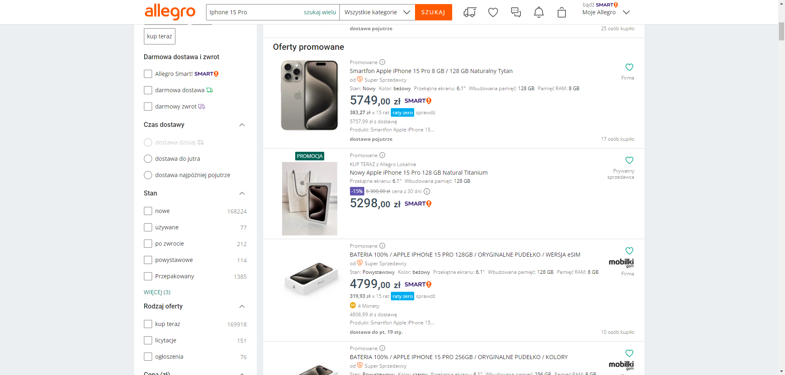

# Allegro search test case

This automated test is created to check your searching results on www.allegro.pl

## Test Case
Test Case: Search for Iphone 15 Pro on Allegro Page

Enviroment: PC, Windows 10, Google Chrome 120.0.6099.201 

Description: Check if user can correctly search for Iphone 15 Pro on allegro page

Priority: High

Test steps:\
1.Open chrome browser \
2.Navigate to "https://www.google.com" \
3.Accpet essential cookies\
4.Type "Allegro" in google search input and press enter key\
5.Open Allegro Page\
6.Accept essential cookies\
7.Type "Iphone 15 Pro" in allegro search input box and press enter key\
8.Take a screenshot with first three promoted auctions

Expected results:\
User can properly go through all steps and search for it's target
Exported png file with first three auctions\
### Output image:

